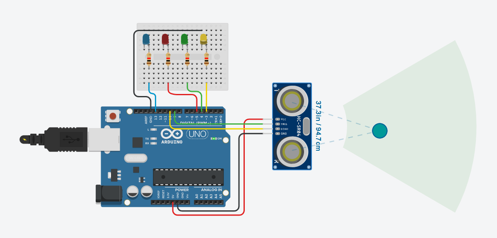
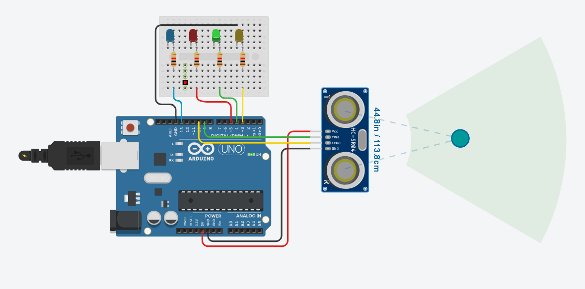
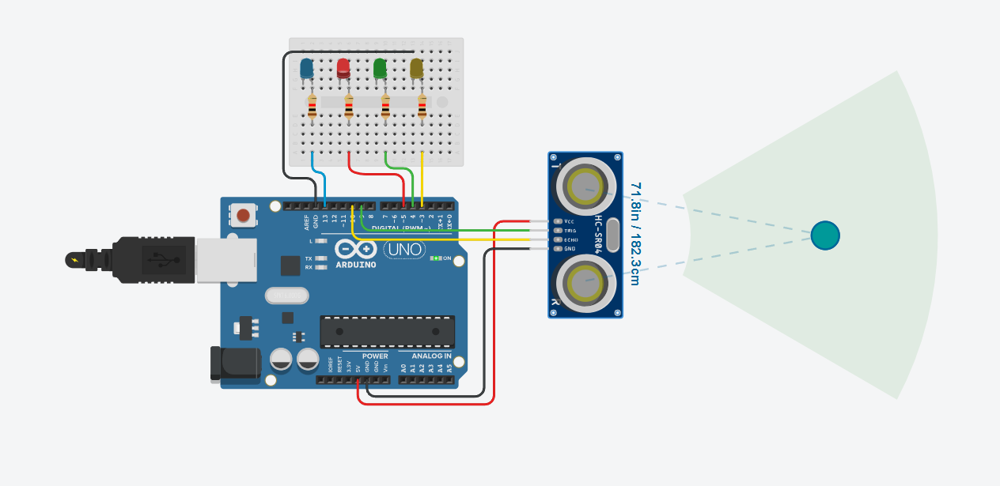

# 📏 Ultrasonic Distance-Based LED Indicator (Arduino + HC-SR04)

This project uses an **HC-SR04 ultrasonic sensor** to measure distance and activates **different LEDs based on the proximity** of an object. The built-in LED and three external LEDs are used to visually indicate how far the object is.

## 🔦 Features

- Measures distance in real-time using the HC-SR04 sensor
- Activates one of four LEDs based on distance:
  - Built-in LED: < 10 cm
  - LED1: 10–14 cm
  - LED2: 15–19 cm
  - LED3: 20–24 cm
- Simple and useful as a visual distance alert system

## 🧰 Hardware Required

- Arduino Uno (or compatible)
- HC-SR04 Ultrasonic Sensor
- 3x LEDs (any color)
- 3x 220Ω resistors
- Jumper wires and breadboard
- USB cable for uploading the code

## 🔌 Pin Configuration

| Component       | Arduino Pin |
|----------------|-------------|
| HC-SR04 TRIG    | 9           |
| HC-SR04 ECHO    | 10          |
| Built-in LED    | 13 (`LED_BUILTIN`) |
| LED1 (Near)     | 3           |
| LED2 (Medium)   | 4           |
| LED3 (Far)      | 5           |

## 💡 Working Logic

- The HC-SR04 sends out an ultrasonic pulse and waits for the echo.
- Based on the time it takes to return, the distance is calculated.
- Depending on the measured distance, one of four LEDs lights up:
  - **< 10 cm** → Built-in LED
  - **10–14 cm** → LED1
  - **15–19 cm** → LED2
  - **20–24 cm** → LED3

## Circuit Diagram

